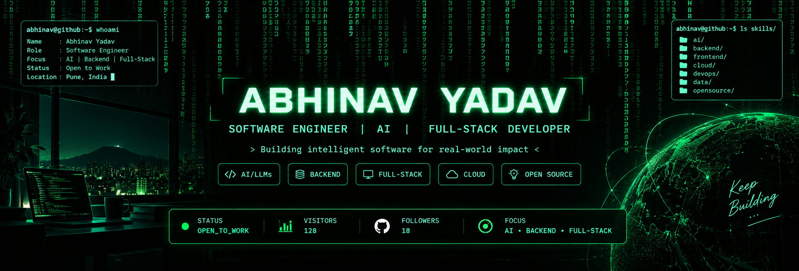

 👋 Hi, I'm Abhinav Yadav

### Software Engineer | AI & Full-Stack Developer

Building intelligent software with **Artificial Intelligence**, **Large Language Models (LLMs)**, and scalable **Full-Stack** applications. Passionate about creating autonomous systems that solve real-world problems.

  

  

  
  
  

---

# 🚀 About Me

* 🎓 Final Year **B.Tech in Computer Science & Engineering**
* 🤖 Passionate about **Artificial Intelligence**, **LLMs**, **Agentic AI**, and **Software Engineering**
* 💻 Building scalable **Full-Stack** and **AI-powered** applications
* ☁️ Currently learning **AWS**, **Docker**, **DevOps**, and **System Design**
* 📚 Strong foundation in **Data Structures & Algorithms**
* 🌱 Always exploring emerging technologies and best engineering practices
* 🚀 Long-term goal: **Build an AI startup focused on autonomous intelligent systems**

---

# 💻 Tech Stack

### Programming Languages

### Frontend

### Backend

### Cloud & DevOps

### Tools

---

# 🌱 Currently Exploring

* 🤖 Agentic AI Systems
* 🧠 Large Language Models (LLMs)
* ⚡ AI Automation
* ☁️ AWS Cloud
* 🐳 Docker & DevOps
* 🏗️ System Design
* 📈 Scalable Backend Architectures

---

# 🏆 Highlights

* 🏅 Smart India Hackathon Participant
* 💻 Built Full-Stack Applications
* 🤖 Developing AI-powered Projects
* 📚 Strong Foundation in Data Structures & Algorithms
* 🌍 Passionate about Open Source & Continuous Learning

---

# 🚀 Featured Projects

| Project                        | Description                             |
| ------------------------------ | --------------------------------------- |
| 🤖 AI Agent Platform           | Autonomous AI workflows powered by LLMs |
| 🌐 Full-Stack Web Applications | React • Node.js • PostgreSQL            |
| 📱 Mobile Applications         | React Native                            |
| 📚 DSA Repository              | Data Structures & Algorithms            |

> Replace these entries with links to your repositories as you publish them.

---

# 📊 GitHub Analytics

  
  

  

---

# 🏆 GitHub Trophies

---

# 📈 Contribution Graph

---

# 🎯 2026 Goals

* 🚀 Build production-ready AI applications
* 🤖 Master Agentic AI & LLM Engineering
* ☁️ Strengthen AWS & DevOps expertise
* 🌍 Contribute to impactful Open Source projects
* 📈 Solve 500+ DSA problems
* 💼 Secure a Software Engineering / AI Internship
* 🏢 Launch an AI startup

---

# 🤝 Connect With Me

---

### 💡 *"Building intelligent software that creates real-world impact."*

Thank you for visiting my profile.

I'm always interested in collaborating on **AI**, **Full-Stack**, and **Open Source** projects.

⭐ **If you like my work, consider starring my repositories!**

